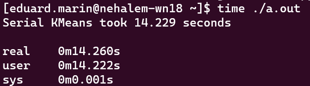
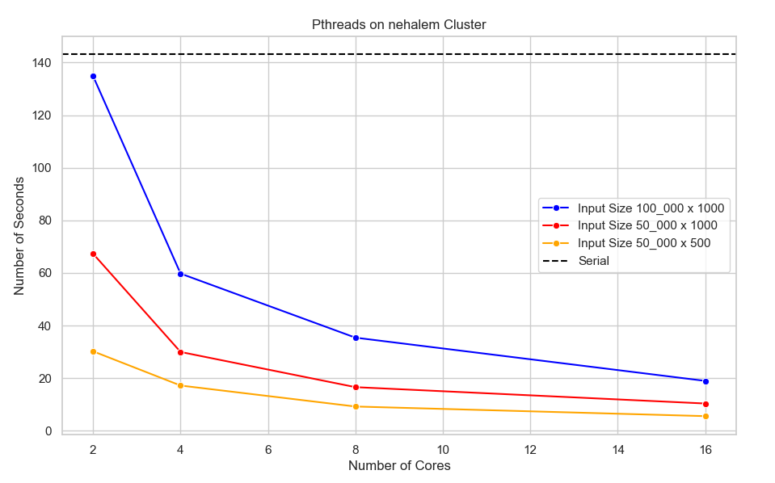
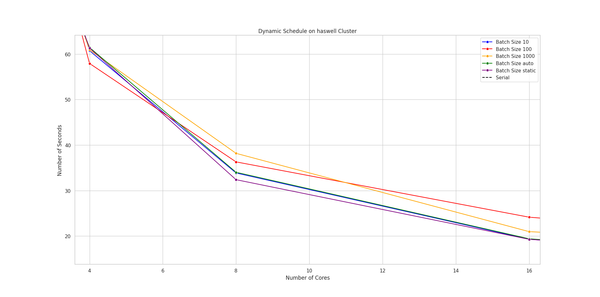

# HW1_APP

## First Week: 

A performance analysis was made for the serial code which consisted of having k = 40 clusters and n = 21000 data points.
In the picture below it can be observed the system compontes on which these tests were made.

    

The execution time it's approximately 45s:

    

    

This code runs in the context of a single thread within the current process:

    

### Runtime on Haswell (serial) : 9.55 s

    

### Runtime on Nehalem (serial) : 14.23 s

    

## Second Week: 

The number of clusters and data points were increased (k = 1000 and n = 100000) to evidence the speedup:

    

    

    

The profiling for OpenMP:

    

    

    

## Third Week: 

### Cluster Analysis

**Serial**

| Input Size      | Nehalem | Haswell |
| ----------- | ----------- | -----------|
| 100_000 x 1000      | **143.125** | **87.167** |

**Pthreads**

Pthreads - Nehalem

| Input Size      | 2 threads | 4 threads | 8 threads | 16 threads |
| ----------- | ----------- | -----------| -----------| -----------|
| 100_000 x 1000      | 134.794 | 59.74 | 35.38 | 18.943 |
| 50_000 x 1000   | 67.277        |29.942 | 16.563 | 10.344 |
|50_000 x 500| 30.185 | 17.178 | 9.197 | 5.545 |

Pthreads - Haswell

| Input Size      | 2 threads | 4 threads | 8 threads | 16 threads | 32 threads |
| ----------- | ----------- | -----------| -----------| -----------| -----------|
| 100_000 x 1000      | 89.367 | 51.804 | 28.695 | 14.375 | 9.655 |
| 50_000 x 1000   | 44.689        |25.043 | 14.043 | 11.878 | 5.128 |
|50_000 x 500| 23.754 | 12.893 | 7.601 | 3.73 | 2.653 |

The Pthreads execution results using **Nehalem** cluser queue:

    

The Pthreads execution results using **Haswell** cluser queue:

    

**OpenMP**

OpenMP (schedule dynamic) - Nehalem
| Batch Size      | 2 threads | 4 threads | 8 threads | 16 threads |
| ----------- | ----------- | -----------| -----------| -----------|
| 10      | 148.257 | 87.084 | 41.73 | 24.026 | 9.655 |
| 100   | 143.948        |76.816 | 43.726 | 26.017 | 5.128 |
|1000| 161.435 | 76.766 | 43.328 | 25.06 | 2.653 |

OpenMP (schedule dynamic) - Haswell
| Batch Size      | 2 threads | 4 threads | 8 threads | 16 threads | 32 threads |
| ----------- | ----------- | -----------| -----------| -----------| -----------|
| 10      | 115.28 | 60.727 | 33.862 | 19.299 | 10.556 |
| 100   | 118.624        |57.926 | 36.297 | 24.152 | 13.855 |
|1000| 107.127 | 60.922 | 38.177 | 20.975 | 14.449 |

OpenMP (schedule auto) - Nehalem
| Batch Size      | 2 threads | 4 threads | 8 threads | 16 threads |
| ----------- | ----------- | -----------| -----------| -----------|
| 1000      | 142.63 | 89.555 | 42.222 | 23.656 |

OpenMP (schedule auto) - Haswell
| Batch Size      | 2 threads | 4 threads | 8 threads | 16 threads | 32 threads |
| ----------- | ----------- | -----------| -----------| -----------| -----------|
| 1000      | 102.299 | 61.44 | 34.019 | 19.407 | 10.101 |

OpenMP (schedule static) - Nehalem
| Batch Size      | 2 threads | 4 threads | 8 threads | 16 threads |
| ----------- | ----------- | -----------| -----------| -----------|
| 1000      | 141.916 | 90.011 | 46.101 | 22.542 |

OpenMP (schedule static) - Haswell
| Batch Size      | 2 threads | 4 threads | 8 threads | 16 threads | 32 threads |
| ----------- | ----------- | -----------| -----------| -----------| -----------|
| 1000      | 104.413 | 61.315 | 32.389 | 19.29 | 10.117 |

It can be observed the idea of having similitudes when speaking about **schedule static**, **schedule dynamic** and **schedule auto** (with BATCH_SIZE=10) directives using **Haswell**.

The OpenMP execution results using **Nehalem** cluser queue:

    

Making Zoom on the area of interest:

    

The OpenMP execution results using **Haswell** cluser queue:

    

Making Zoom on the area of interest:

    

**MPI**

MPI - Nehalem

| Input Size      | 2 Processes | 4 Processes | 8 Processes | 16 Processes | 32 Processes | 64 Processes | 128 Processes | 256 Processes| 512 Processes|
| ----------- | ----------- | -----------| -----------| -----------| ----------- | ----------- | -----------| -----------| -----------|
| 100_000 x 1000      | 77.469 | 39.392 | 20.708 | 16.726 | 17.046 | 18.957 | 20.937 | ? | 61.669 |
| 50_000 x 1000       | 39.148 | 20.440 | 11.173 | 9.261 | 10.114 | 11.059 | 13.234 | ? | 47.971 |
| 50_000 x 500        | 20.687 | 11.249 | 6.484 | 6.012 | 6.145 | 7.217 | 9.897 | ? | 38.113 |

MPI - Haswell

| Input Size      | 2 Processes | 4 Processes | 8 Processes | 16 Processes | 32 Processes | 64 Processes | 128 Processes | 256 Processes|  512 Processes|
| ----------- | ----------- | -----------| -----------| -----------| ----------- | ----------- | -----------| -----------| -----------|
| 100_000 x 1000      | 45.781 | 24.748 | 14.793 | 9.613 | 9.501 | 16.242 | 19.344 | ? | 49.467 |
| 50_000 x 1000       | 24.095 | 14.026 | 8.386 | 6.039 | 6.260 | 10.367 | 14.173 | ? | 44.060 |
| 50_000 x 500        | 13.410 | 8.011 | 5.443 | 4.501 | 4.631 | 8.326 | 11.119 | ? | 35.298 |

## Fourth Week: 

### Adding the implementation of MPI and doing profiling on cluster for Pthread and OpenMP

The MPI execution results using **Nehalem** cluser queue:

    

The MPI execution results using **Haswell** cluser queue:

    

Execution of MPI using a smaller number of processes:

    

    

The Vtune execution results for **Pthreads**:

    

At hotspots it can be observed that the euclidian distance function is the most CPU clock / time consuming:

    

The Vtune execution results for **OpenMP**:

    

At hotspots it can be observed that the euclidian distance function is the most CPU clock / time consuming for **OpenMP** too:

    

It can be also observed the differences between **OpenMP** scheduling policies, Auto and Static ones being the most better:

    

# Speedups:

    

    

# Efficiencies:

    

    

Special thanks to Marin Eduard-Constantin and Coman Calin-Alexandru (my classmates) for their creative ideas and wonderful support while making this project.
